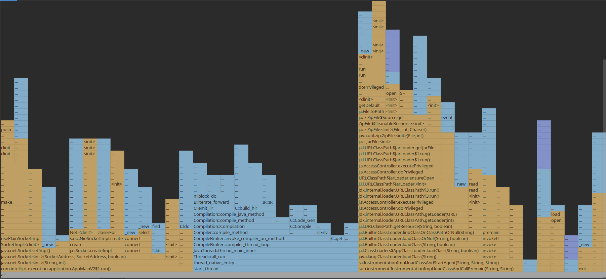
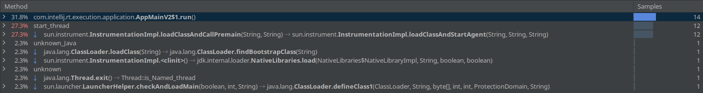
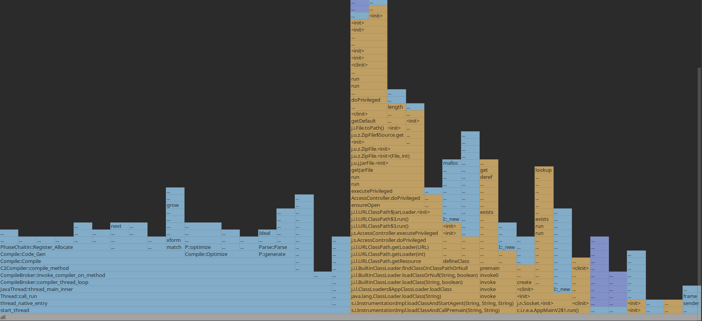
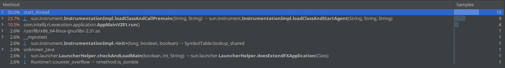

# Optimization via profiler

### Initial code (#15)

``` java
public class Initial {

    private static int func1(int a, int b) throws InterruptedException {
        int res = 0;
        for(int i = 0; i < 10; i++)
        {
            Thread.sleep(1);
            if(i>8)
                res = resultOfSum(a, b);
            if(res > 0)
                return res;
        }
        return res;
    }

    private static int func2(int a, int b, int c) throws InterruptedException {
        int res = 0;
        for(int i = 0; i < 10; i++) {
            b--;
            if(c > b) {
                res = func1(a, b);
            } else {
                res = func1(a, c);
            }
            if(res > 0) {
                return res;
            }
        }

        return res;
    }

    private static int  resultOfSum(int a, int b) {
        return a + b;
    }
    //51 110 12
    public static void main(String[] args) throws InterruptedException {
        System.out.println(func2(51, 110, 12));
    }
}

```

### Optimization
I have removed the `sleep` call, as well as redundant for-loop in the first function. Since there was a check on the 
iterator, it looped 8 times before moving forward, so we could just replace it with `resultOfSum` call.
Then, `resultOfSum` calls were replaced by simple addition in order to avoid unnecessary calls. As a result, both 
functions were removed and only `func2` is left.

``` java
    public class Optimized {

    private static int func2(int a, int b, int c)  {
        int res = 0;
        for(int i = 0; i < 10; i++) {
            b--;
            if(c > b) {
                res = a + b;
            } else {
                res = a + c;
            }
            if(res > 0) {
                return res;
            }
        }
        return res;
    }

    //51 110 12
    public static void main(String[] args) {
        System.out.println(func2(51, 110, 12));
    }
}

```
# Results
### Initial results
Profiler output

Call tree
 
### Optimized code results
Profiler output

Call tree
 